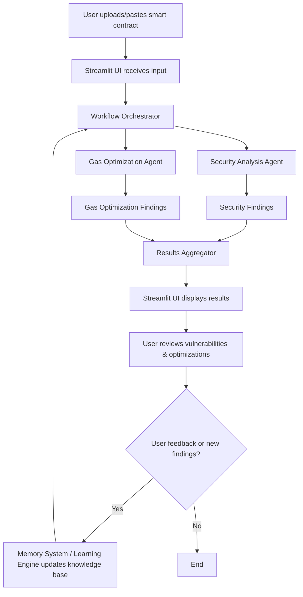
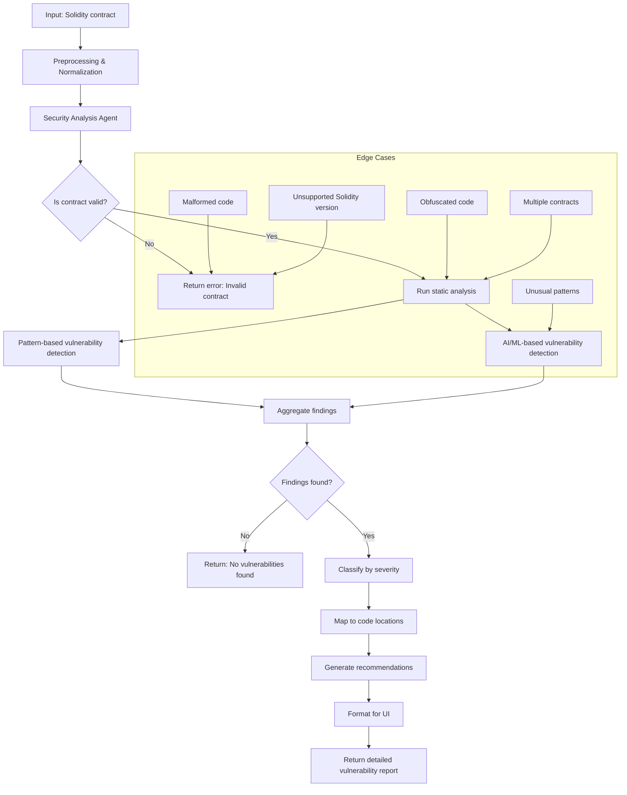
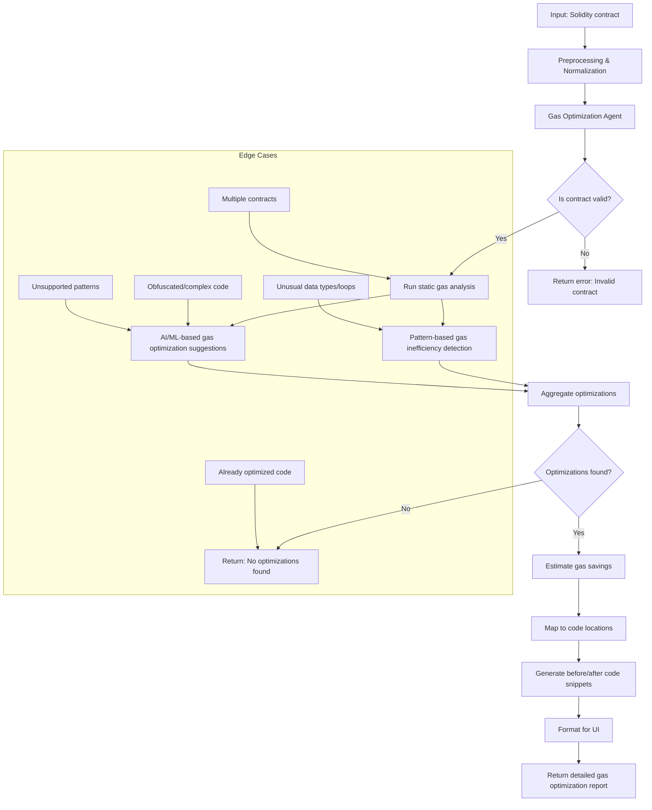

# ZERA AI Agent - Smart Contract Security & Gas Optimization Tool

ZERA is an advanced AI-powered tool for comprehensive smart contract auditing, focusing on security vulnerability detection and gas optimization recommendations.

## 🚀 Features

- **Multi-Agent Security Analysis**: Leverages specialized AI agents for thorough smart contract security auditing
- **Gas Optimization**: Identifies and provides detailed gas savings recommendations
- **Interactive Streamlit Interface**: User-friendly web interface for contract analysis
- **Memory System**: Persistent learning and memory storage for improved analysis over time
- **Real-time Analysis**: Immediate feedback and detailed reporting

## 🧠 Architecture & Process Flows

### Auditing Agent Conceptual Flow

)


### Agentic Flow with Learning



**How the Agent Learns:**
- After each analysis, the agent stores new vulnerabilities, optimizations, and user feedback in a persistent memory system.
- This knowledge base is referenced in future analyses to improve detection, avoid false positives, and provide more relevant recommendations.
- The learning engine adapts over time, enabling the agent to recognize new patterns and edge cases based on historical data and user interactions.

### Vulnerability Finding Flow (Detailed, All Cases)



### Gas Optimization Flow (Detailed, All Cases)



## 🛠️ Installation

### Prerequisites

- Python 3.8 or higher
- pip package manager

### Setup

1. **Clone the repository**
   ```bash
   git clone https://github.com/yourusername/AI-AGENT.git
   cd AI-AGENT
   ```

2. **Create a virtual environment**
   ```bash
   python -m venv venv
   source venv/bin/activate  # On Windows: venv\Scripts\activate
   ```

3. **Install dependencies**
   ```bash
   pip install -r requirements.txt
   ```

4. **Initialize the database**
   ```bash
   python init_database.py
   ```

## 🚀 Usage

### Quick Start

Run the start script to launch the Streamlit interface:
```bash
./start_zera.sh
```

Or manually:
```bash
source venv/bin/activate
streamlit run streamlit_app.py
```

### Using the Interface

1. **Upload Contract**: Paste your Solidity smart contract code in the text area
2. **Start Analysis**: Click "Start Security Audit" to begin the analysis
3. **Review Results**: 
   - View security vulnerabilities with severity levels
   - Check gas optimization recommendations
   - Review estimated gas savings

### Command Line Usage

For direct Python usage:
```bash
python main.py
```

## 📁 Project Structure

```
AI-AGENT/
├── streamlit_app.py          # Main Streamlit web interface
├── workflow_orchestrator.py  # Core analysis orchestration
├── agents_manager.py         # AI agents management
├── main.py                  # Command line interface
├── learning_engine.py       # Learning and memory system
├── shared_context.py        # Shared context management
├── settings.py              # Configuration settings
├── init_database.py         # Database initialization
├── requirements.txt         # Python dependencies
├── start_zera.sh           # Launch script
├── .gitignore              # Git ignore rules
└── README.md               # This file
```

## 🔧 Configuration

The tool uses several configuration files and environment variables:

- **Database**: SQLite database for persistent memory storage
- **Settings**: Modify `settings.py` for custom configurations
- **Environment Variables**: Use `.env` file for API keys and sensitive data

## 🔍 Analysis Types

### Security Vulnerabilities

- **Critical**: Immediate security risks requiring urgent attention
- **High**: Significant security concerns
- **Medium**: Important security considerations
- **Low**: Minor security improvements

### Gas Optimizations

- **Storage Optimizations**: Efficient storage usage patterns
- **Loop Optimizations**: Gas-efficient loop implementations
- **Function Optimizations**: Optimized function designs
- **Data Type Optimizations**: Efficient data type usage

## 📊 Output Formats

### Vulnerability Reports
- Detailed vulnerability descriptions
- Severity classifications
- Recommended fixes
- Code location references

### Gas Optimization Reports
- Specific optimization recommendations
- Estimated gas savings
- Before/after code comparisons
- Implementation guidance

## 🤝 Contributing

1. Fork the repository
2. Create a feature branch (`git checkout -b feature/AmazingFeature`)
3. Commit your changes (`git commit -m 'Add some AmazingFeature'`)
4. Push to the branch (`git push origin feature/AmazingFeature`)
5. Open a Pull Request

## 📝 Development Notes

### Recent Improvements

- Enhanced gas optimization parsing with improved regex patterns
- Fixed color contrast issues for better accessibility
- Robust error handling for gas savings aggregation
- Comprehensive test coverage for parsing logic

### Testing

The project includes comprehensive test files for debugging and validation:
- Gas optimization parsing tests
- Security vulnerability extraction tests
- Integration tests for the full analysis pipeline

## 🐛 Troubleshooting

### Common Issues

1. **Import Errors**: Ensure all dependencies are installed in the virtual environment
2. **Database Issues**: Run `python init_database.py` to reinitialize the database
3. **Memory Issues**: Clear session data using the "Reset Session Data" button in the Streamlit sidebar

### Debug Mode

For detailed debugging output, check the console logs when running the application.

## 📄 License

This project is licensed under the MIT License - see the LICENSE file for details.

## 🔗 Links

- [Documentation](./PARSING_IMPROVEMENTS.md)
- [Gas Optimization Guide](./GAS_OPTIMIZATION_ENHANCEMENTS.md)
- [Issue Tracker](https://github.com/yourusername/AI-AGENT/issues)

## ⚠️ Disclaimer

This tool is for educational and analysis purposes. Always conduct thorough manual reviews and testing before deploying smart contracts to production environments.


**Concepts Illustrated:**
- **Initiation:** Audit begins with scope and threat modeling.
- **Knowledge Base:** Agent references prior knowledge, standards, and memory.
- **Analysis:** Multi-modal static, dynamic, and AI/ML analysis for comprehensive coverage.
- **Problem Identification:** Systematically classifies vulnerabilities and inefficiencies.
- **Remediation:** Generates actionable solutions and recommendations.
- **Reporting:** Compiles findings into user-friendly reports.
- **Feedback and Learning:** User feedback and new findings are used to update the agent’s knowledge, closing the learning loop.
